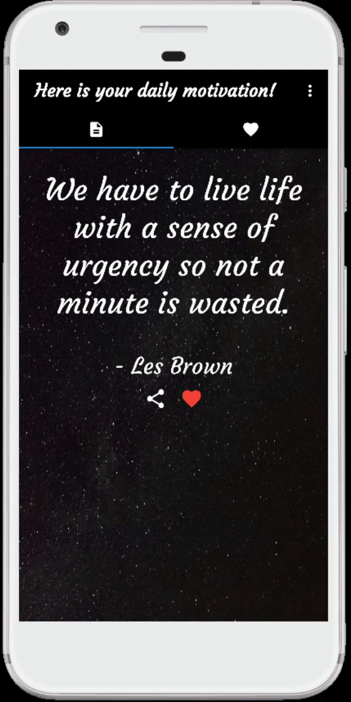

<div id="top"></div>

<!-- PROJECT SHIELDS -->
<!--
*** Reference link notation in markdown. Look at the bottom of the file
*** for all links to the shields.
*** https://www.markdownguide.org/basic-syntax/#reference-style-links
-->
[![MIT License][license-shield]][license-url]
[![LinkedIn][linkedin-shield]][linkedin-url]

<!-- PROJECT LOGO -->
<br />
<div align="center">
  <a href="https://github.com/PattyCoding123/mobile_motivation">
    
  </a>
  
<h1 align="center">Mobile Motivation</h1>

  <p align="center">
    Mobile Motivation is my second project with the Flutter framework. It includes a finished app that pulls a motivational quote from an api and utilizes Firebase for backend authentication and data storage.
    <br />
    <a href="https://github.com/PattyCoding123/mobile_motivation"><strong>Check out the docs »</strong></a>
    <br />
    <br />
    <a href="https://github.com/PattyCoding123/mobile_motivation">Report Bug</a>
    ·
    <a href="https://github.com/PattyCoding123/mobile_motivation">Request Feature</a>
  </p>
</div>


<!-- TABLE OF CONTENTS -->
<details>
  <summary>Table of Contents</summary>
  <ol>
    <li>
      <a href="#about-the-project">About The Project</a>
      <ul>
        <li><a href="#built-with">Built With</a></li>
      </ul>
    </li>
    <li>
      <a href="#getting-started">Getting Started</a>
      <ul>
        <li><a href="#prerequisites">Prerequisites</a></li>
        <li><a href="#installation-and-running">Installation and Running</a></li>
      </ul>
    </li>
    <li><a href="#usage">Usage</a></li>
    <li><a href="#roadmap">Roadmap</a></li>
    <li><a href="#contributing">Contributing</a></li>
    <li><a href="#license">License</a></li>
    <li><a href="#contact">Contact</a></li>
    <li><a href="#acknowledgments">Acknowledgments</a></li>
  </ol>
</details>


<!-- ABOUT THE PROJECT -->
## About The Project

The Mobile Motivation project is my second project using the Flutter framework as well as working with backend software. I was inspired by a guide from [Anoob Bava] to remake the daily quotes app but with more backend functionality such as user authentication, cloud storage, and a theme mode settings. The app displays a daily quote from an API in which the user can favorite and share. Additionally, the app will store the favorited quotes in the cloud and will allow the user to look at their past favorite quotes or delete them if they wish.

<p align="right">(<a href="#top">back to top</a>)</p>


### Built With

* [![Flutter][Flutter-shield]][Flutter-url]
* [![Firebase][Firebase-shield]][Firebase-url]
* [![Android Studio][Android-Studio-shield]][Android-Studio-url]
<p align="right">(<a href="#top">back to top</a>)</p>


<!-- GETTING STARTED -->
## Getting Started

Since the app utilizes the Flutter framework, it is best to install an IDE that is compatible with Flutter such as Android Studio or VS Code.

Once you have a compatible IDE installed, you can move to the prerequisites section to see what you must install.

### Prerequisites
* Flutter - read the installation documentation [here](https://docs.flutter.dev/get-started/install)
* Android device (minimum SDK >= 19) or an iOS device to run the application. 
* If you lack a device, download [Android Studio][Android-Studio-url] and configure an [Android emulator](https://developer.android.com/studio/run/emulator).


### Installation and Running

1. Clone the repo
   ```sh
   git clone https://github.com/PattyCoding123/mobile_motivation.git
   ```
2. In the project directory, run "flutter pub get" in the terminal.
   ```sh
   ...\mobile_motivation> flutter pub get
   ```
3. In the project directory, run "flutter run" in the terminal. You will be given an option of what device to run on. Use the Android emulator or physical Android/iOS device.
   ```sh
   ...\mobile_motivation> flutter run
   ```


<p align="right">(<a href="#top">back to top</a>)</p>


<!-- USAGE EXAMPLES -->
## Usage

When first opening the app, you are given a login page along with multiple buttons that that lead to other forms of authentication such as sign-up forms and password-resets.
<br />


<br />
<br />

Then, once you log in, you can see the current quote of the day which you can favorite. On top of the app are two tabs. The first tab contains the daily quote, and the second tab contains the list of all the quotes you liked.
<br />


<br />
<br />

From the first tab, you can tap the share icon which will pull up the quote and author text that you can copy and share.
<br />


<br />
<br />

You can the delete a quote if you wish.
<br />


<br />
<br />

Finally, in the first tab, you can see a popup menu button at the top right that leads to the settings page and the logout button. In the settings, you can change the theme of the app to dark or light mode which will be saved to your local preferences.
<br />


<p align="right">(<a href="#top">back to top</a>)</p>


<!-- ROADMAP -->
## Roadmap

- [x] User authentication
- [x] Successfully fetch from an API
- [x] Cloud storage
- [x] Dark and Light mode

See the [open issues](https://github.com/PattyCoding123/my-notes-project/issues) for a full list of proposed features (and known issues).

<p align="right">(<a href="#top">back to top</a>)</p>


<!-- CONTRIBUTING -->
## Contributing

If you have a suggestion that would make this project better or more optimal, please fork the repo and create a pull request. Alternatively, you can open an issue with the tag "enhancement" as well.

1. Fork the Project
2. Create your Feature Branch (`git checkout -b feature/NewFeature`)
3. Commit your Changes (`git commit -m 'Add some NewFeature'`)
4. Push to the Branch (`git push origin feature/NewFeature`)
5. Open a Pull Request

<p align="right">(<a href="#top">back to top</a>)</p>


<!-- LICENSE -->
## License

Distributed under the MIT License. See `LICENSE.md` for more information.

<p align="right">(<a href="#top">back to top</a>)</p>


<!-- CONTACT -->
## Contact

Patrick Ducusin - patrickducusin2@gmail.com

Project Link: [https://github.com/PattyCoding123/mobile_motivation](https://github.com/PattyCoding123/mobile_motivation)

<p align="right">(<a href="#top">back to top</a>)</p>


<!-- ACKNOWLEDGMENTS -->
## Acknowledgments
* [Article by Anoob Bava that provides a tutorial for the framework of this project](https://medium.com/flutter-community/create-a-motivation-app-using-flutter-391de123a382)
* [Zenquotes for their free daily quote API](https://zenquotes.io/)
* [Space ship icon provided by svgrepo.com](https://www.svgrepo.com/)
* [Login page background image provided by publicdomainpictures.net](https://www.publicdomainpictures.net/)
* [Home page background image provided by Stocksnap.io](Stocksnap.io)

<p align="right">(<a href="#top">back to top</a>)</p>


<!-- MARKDOWN LINKS & IMAGES -->
<!-- https://www.markdownguide.org/basic-syntax/#reference-style-links -->
[license-shield]: https://img.shields.io/github/license/PattyCoding123/mobile_motivation?color=%23808080&style=for-the-badge
[license-url]: https://github.com/PattyCoding123/my-notes-project/blob/master/LICENSE.md
[linkedin-shield]: https://img.shields.io/badge/-LinkedIn-black.svg?style=for-the-badge&logo=linkedin&colorB=555
[linkedin-url]: https://www.linkedin.com/in/patrick-ducusin-879b25208/
[product-screenshot]: images/screenshot.png
[Flutter-shield]: https://img.shields.io/badge/Flutter-02569B?style=for-the-badge&logo=flutter&logoColor=white
[Flutter-url]: https://flutter.dev/
[Firebase-shield]: https://img.shields.io/badge/firebase-ffca28?style=for-the-badge&logo=firebase&logoColor=black
[Firebase-url]: https://firebase.google.com/
[Android-Studio-shield]: https://img.shields.io/badge/Android_Studio-3DDC84?style=for-the-badge&logo=android-studio&logoColor=white
[Android-Studio-url]: https://developer.android.com/studio
